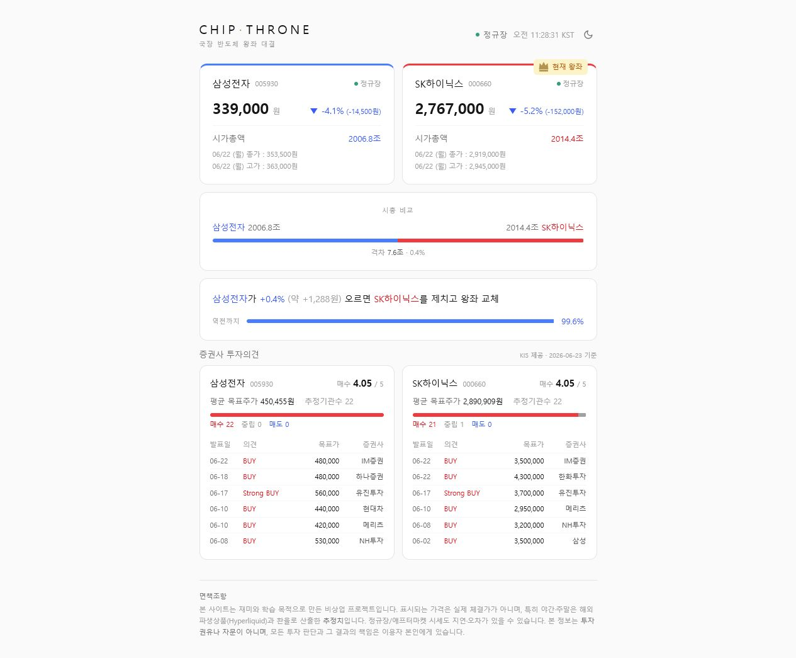

# CHIP·THRONE

> 투자 조언은 드리지 못합니다. 다만 **오늘 누가 왕좌에 앉아 있는지**는 실시간으로 알려드립니다.

삼성전자와 SK하이닉스 — 국장 시가총액 1·2위를 두고 늘 엎치락뒤치락하는 두 반도체 거인 중, **지금 이 순간 더 비싼 회사는 누구인가**를 한 화면에서 보여주는 **실시간 대시보드**입니다.

🔗 https://chipthrone.com



## 무엇을 보여주나

- **시총 1·2위 실시간 비교** — 두 회사의 주가·시가총액과 격차(조·%)를 나란히
- **역전까지 몇 %** — "삼성전자가 +3.1%(약 +11,130원) 오르면 왕좌 교체" + 근접도 게이지
- **시간대별 실제 시세** — 프리마켓·정규장·애프터마켓은 한국투자증권(KIS) 실거래가
- **장 마감 후 추정 시세** — 야간·주말·공휴일엔 해외 파생(Hyperliquid)×환율로 다음 날 분위기를 미리
- **증권사 투자의견** — 평균 목표주가, 추정기관 수, 매수/중립/매도 분포
- **라이트 / 다크 테마**

## 시세는 시간대별로 이렇게

| 시간 (KST, 거래일) | 표시 | 출처 |
|---|---|---|
| 08:00 ~ 09:00 | 프리마켓 (실거래가) | KIS · 넥스트레이드(NXT) |
| 09:00 ~ 15:30 | 정규장 (실거래가) | KIS · KRX |
| 15:40 ~ 20:00 | 애프터마켓 (실거래가) | KIS · 넥스트레이드(NXT) |
| 그 외 · 주말 · 공휴일 | 추정 시세 | Hyperliquid 해외 파생 × 환율 |

> 거래가 멈추는 공백 시간(08:50~09:00, 15:20~15:40)에는 직전 체결가를 그대로 보여줍니다.

## 로컬에서 실행하기

### Docker로 한번에 (권장)

도커만 있으면 한 줄로 백엔드·프론트가 함께 뜹니다.

```bash
docker compose up --build
```

- 프론트 **http://localhost:5173** · 백엔드 **http://localhost:8080**
- 종료: `Ctrl+C` (또는 `docker compose down`)

### 직접 실행

필요: **Java 21**, **Node 20 이상**

```bash
# 백엔드 — http://localhost:8080
cd backend
./gradlew bootRun           # Windows: gradlew.bat bootRun

# 프론트엔드 — http://localhost:5173
cd frontend
npm install
npm run dev
```

### KIS 키 (선택)

**키가 없어도 동작**합니다 — 실거래가 대신 해외 추정 시세로 폴백. 실거래가·투자의견까지 보려면 환경변수를 주입하세요(한국투자증권 [KIS Developers](https://apiportal.koreainvestment.com) 무료 발급):

```bash
# Docker
KIS_APP_KEY=... KIS_APP_SECRET=... docker compose up --build

# 직접 실행(백엔드)
KIS_APP_KEY=... KIS_APP_SECRET=... ./gradlew bootRun
```

프론트가 다른 주소의 백엔드를 바라보게 하려면 `frontend/.env`에 `VITE_API_URL`을 지정하세요(기본값 `http://localhost:8080`).

## 더 보기

- 만든 이야기: https://www.yeonwoo.dev/work/chipthrone

---

투자 참고용 서비스이며, 표시되는 추정 시세는 공식 거래소 체결가가 아닙니다. 본 서비스는 투자 자문이 아닙니다.
