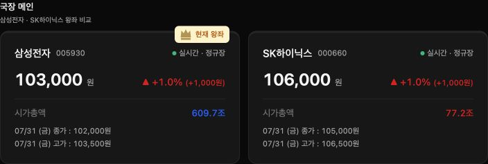
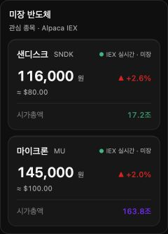

# CHIP·THRONE

> 투자 조언은 드리지 못합니다. 다만 **오늘 누가 왕좌에 앉아 있는지**는 실시간으로 알려드립니다.

삼성전자와 SK하이닉스의 주가·시가총액을 비교하고, 관심 있는 미국 반도체 주가를 함께 보는 실시간 대시보드입니다.

🔗 https://chipthrone.com



미국 반도체 관심 종목은 메인 비교를 방해하지 않도록 좁은 보조 사이드바에 표시한다.



## 무엇을 보여주나

- **국장 메인 비교** — 삼성전자·SK하이닉스의 주가·시가총액과 격차를 나란히
- **미장 관심 종목** — 샌디스크·마이크론·브로드컴 중 최대 2개를 사이드에서 선택·저장
- **역전까지 몇 %** — "삼성전자가 +3.1%(약 +11,130원) 오르면 왕좌 교체" + 근접도 게이지
- **명확한 화면 우선순위** — 국장 비교가 본문, 미국 반도체 주가는 데스크톱 우측·모바일 하단 보조 영역
- **시간대별 실제 시세** — 국장은 KIS, 미장은 Alpaca 무료 IEX 시세
- **장 마감 후 추정 시세** — 야간·주말·공휴일엔 해외 파생(Hyperliquid)×환율로 다음 날 분위기를 미리
- **증권사 투자의견** — 평균 목표주가, 추정기관 수, 매수/중립/매도 분포
- **라이트 / 다크 테마**
- **공유 수요 기반 수집** — 사용자별 polling 없이 활성 고유 종목만 수집하고 SSE fan-out

## 시세는 시간대별로 이렇게

| 시장 | 거래 시간 | 표시 | 출처 |
|---|---|---|---|
| 국장 | KST 08:00~09:00, 09:00~15:30, 15:40~20:00 | 실제 시세 | KIS NXT/KRX |
| 미장 | ET 09:30~16:00 | IEX 실시간 | Alpaca Basic |
| 휴장·소스 장애 | 그 외 | 추정 시세 | Hyperliquid 해외 파생 × 환율 |

## 로컬에서 실행하기

### Docker로 한번에 (권장)

도커만 있으면 한 줄로 백엔드·프론트가 함께 뜹니다.

```bash
docker compose up --build
```

- 프론트 **http://localhost:5173** · 백엔드 **http://localhost:8080**
- 종료: `Ctrl+C` (또는 `docker compose down`)

### 직접 실행

필요: **Java 21**, **Node 20 이상**

```bash
# 백엔드 — http://localhost:8080
cd backend
./gradlew bootRun           # Windows: gradlew.bat bootRun

# 프론트엔드 — http://localhost:5173
cd frontend
npm install
npm run dev
```

### 시세 API 키 (선택)

**키가 없어도 동작**합니다 — 실거래가 대신 해외 추정 시세로 폴백. 실거래가·투자의견까지 보려면 환경변수를 주입하세요(한국투자증권 [KIS Developers](https://apiportal.koreainvestment.com) 무료 발급):

```bash
# Docker
KIS_APP_KEY=... KIS_APP_SECRET=... docker compose up --build

# 직접 실행(백엔드)
KIS_APP_KEY=... KIS_APP_SECRET=... ./gradlew bootRun
```

미장 IEX 시세는 [Alpaca Basic](https://docs.alpaca.markets/us/docs/about-market-data-api)의 무료 API 키를 사용한다. 키가 없거나 호출에 실패하면 Hyperliquid 추정 시세로 폴백한다.

```bash
ALPACA_API_KEY=... ALPACA_API_SECRET=... docker compose up --build
```

프론트가 다른 주소의 백엔드를 바라보게 하려면 `frontend/.env`에 `VITE_API_URL`을 지정하세요(기본값 `http://localhost:8080`).

## 더 보기

- 만든 이야기: https://yeonwoo.dev/work/chipthrone
- 수요 기반 수집 설계와 실제 부하 결과: [docs/06-demand-driven-quotes.md](docs/06-demand-driven-quotes.md)

---

투자 참고용 서비스다. Alpaca Basic은 전체 미국 거래소 통합시세가 아닌 IEX 범위이며, 추정 시세는 공식 거래소 체결가가 아니다. 본 서비스는 투자 자문이 아니다.
