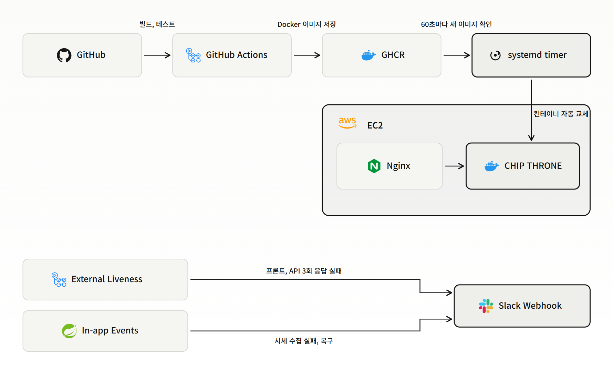

# CHIPTHRONE

삼성전자와 SK하이닉스가 시가총액 1위를 겨루는 모습을 한 화면에서 볼 수 있는 대시보드입니다. 해외 파생시장의 추정 시세로 두 회사의 시가총액을 비교하고, 관심 있는 미국 반도체와 AI 종목도 함께 살펴볼 수 있습니다.

[chipthrone.com](https://chipthrone.com)


## 주요 기능

### 시가총액 비교

해외 추정 가격과 상장주식 수로 삼성전자와 SK하이닉스의 추정 시가총액을 비교합니다. 현재 1위와 두 회사의 비중, 왕좌가 바뀌려면 주가가 얼마나 움직여야 하는지 함께 보여줍니다.

전날 종가는 금융위원회 주식시세정보의 제3자 제공이 제한되어 더 이상 표시하지 않습니다.

### 해외 추정 시세

Hyperliquid의 해외 파생 가격을 업비트 KRW-USDC 최우선 호가의 중간값으로 원화 환산한 추정값입니다. 원화 추정 가격과 달러 가격, 추정 시가총액을 볼 수 있습니다.

Hyperliquid를 쓰는 것은 이 시장에서 가격이 실제 주가를 기준으로 맞춰지기 때문입니다. 한국 장중에는 오라클 가격이 실제 주가를 따르고 매시간 정산되는 펀딩비가 거래 가격을 오라클 가격 쪽으로 붙잡습니다. 2026년 8월 3일 장중 실측에서 삼성전자의 거래 가격과 오라클 가격은 0.03% 차이가 났습니다.

다만 장이 닫힌 시간에는 기준이 되는 실제 주가가 없어 차이가 커지고 실제 주식 체결가와도 다를 수 있습니다.

### 미국 반도체와 AI

반도체와 M7 목록에서 관심 종목을 골라 볼 수 있습니다. 선택한 종목의 추정 가격과 원화 환산 가격, 추정 시가총액, 종가 대비 등락률이 카드로 표시됩니다. 선택 결과는 브라우저에 저장됩니다.

## 아키텍처



GitHub Actions에서 테스트와 빌드를 마친 이미지는 GHCR에 저장됩니다. EC2의 systemd timer는 60초마다 새 이미지를 확인하고 비활성 슬롯에 먼저 실행합니다. Readiness 검증을 통과한 뒤에만 Nginx를 전환하고, 기존 슬롯은 SSE 연결이 끝날 때까지 유지합니다. 전환 뒤 후보가 연속으로 실패하면 이전 슬롯으로 자동 롤백합니다.

## CI/CD

PR과 `main` 반영 시 인프라 스크립트를 검사하고 백엔드 빌드와 테스트, 프론트엔드 빌드를 실행합니다. `main`에 백엔드 변경이 반영되면 Docker 이미지를 만들고 `latest`와 커밋 SHA 태그를 붙여 GHCR에 저장합니다.

- [CI 워크플로에서 검증 과정 보기](https://github.com/ppupy1209/chipthrone/blob/main/.github/workflows/ci.yml)
- [배포 워크플로에서 이미지 빌드 과정 보기](https://github.com/ppupy1209/chipthrone/blob/main/.github/workflows/deploy-backend.yml)

## SSH 접속 없이 자동 배포하기

### 문제

처음에는 GitHub Actions 러너가 EC2에 SSH로 접속해 재배포하도록 구성했습니다. 하지만 이 단계에서 `i/o timeout`이 발생했습니다. 22번 포트는 개인 IP만 허용한 상태였습니다. 실행할 때마다 달라지는 GitHub Actions 러너의 IP를 허용 목록에 계속 추가하기도 어려웠습니다. 22번 포트를 전체 접근 허용으로 바꾸는 방안도 검토했습니다. 하지만 SSH 포트를 외부에 여는 것은 보안상 적절하지 않다고 판단했습니다.

### 해결

대신 배포 방식을 push에서 pull로 바꿨습니다. GitHub Actions는 이미지를 GHCR에 저장하는 데까지만 관여합니다. EC2의 systemd timer가 60초마다 새 이미지를 확인하므로 외부에서 EC2에 접속할 필요가 없습니다.

새 이미지는 blue와 green 중 비활성 슬롯에 올라갑니다. Readiness가 확인되면 Nginx를 새 슬롯으로 전환하고, 기존 SSE 연결은 이전 슬롯에서 최대 310초 동안 마저 처리합니다. 후보가 전환 후 연속 3회 응답하지 않으면 Nginx를 이전 슬롯으로 되돌립니다. 실패한 이미지 ID는 기록해 같은 이미지를 60초마다 다시 배포하지 않습니다.

이 방식으로 22번 포트는 계속 개인 IP에만 허용할 수 있고, 배포 과정에서 SSH 키와 러너 IP를 별도로 관리하지 않습니다.

## 로컬 실행

Git과 Docker Desktop을 설치한 뒤 Docker가 실행 중인지 확인해 주세요.

### 1. 저장소 내려받기

```bash
git clone https://github.com/ppupy1209/chipthrone.git
cd chipthrone
```

### 2. 실행하기

```bash
docker compose up --build -d
```

처음 실행할 때는 이미지를 빌드하므로 몇 분 정도 걸릴 수 있습니다. 실행 상태는 다음 명령으로 확인합니다.

```bash
docker compose ps
```

### 3. 접속하기

- 웹 화면: `http://localhost:5173`
- API: `http://localhost:8080`

### 4. 종료하기

```bash
docker compose down
```

## 이용 안내

CHIPTHRONE은 시세 비교를 위한 정보 서비스이며 투자 권유나 자문을 제공하지 않습니다.
