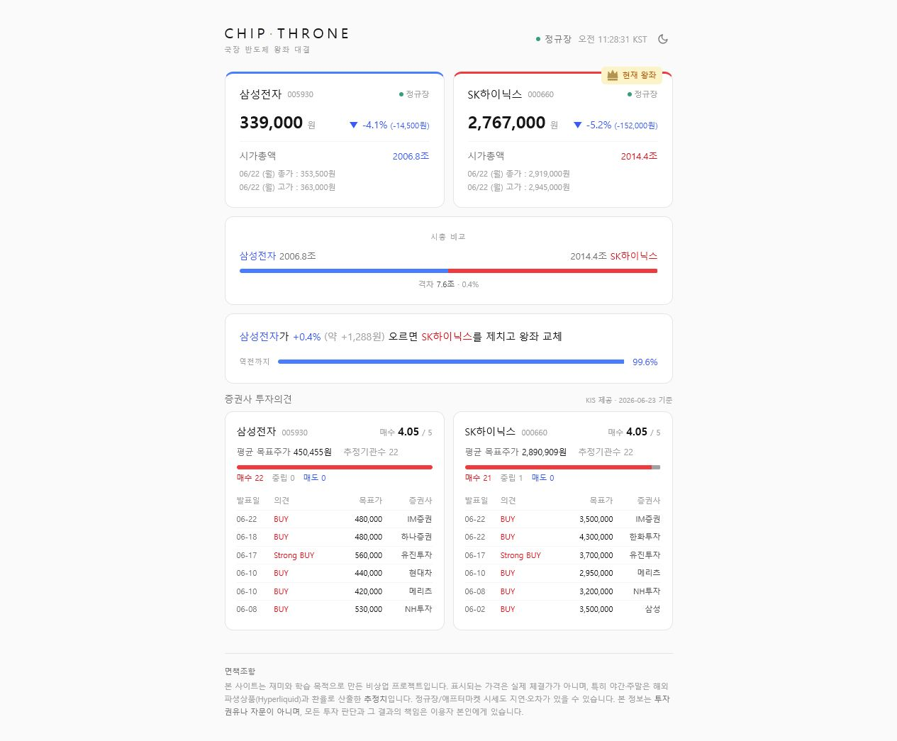
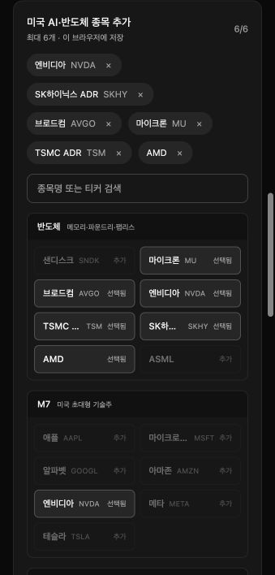

# CHIPTHRONE

삼성전자와 SK하이닉스의 시가총액과 시세를 한눈에 비교하는 대시보드입니다. 공공데이터로 집계한 확정값과 Hyperliquid를 바탕으로 계산한 24시간 추정값을 나란히 볼 수 있습니다. 관심 있는 미국 AI와 반도체 종목도 같은 화면에 추가할 수 있습니다.

[chipthrone.com](https://chipthrone.com)



## 시세를 보는 방법

- 확정 시세에서는 금융위원회 주식시세정보의 종가와 시가총액, 기준일, 왕좌 교체 조건을 확인할 수 있습니다.
- 24시간 추정 시세는 Hyperliquid 가격을 Pyth Network의 USD/KRW 환율로 바꾼 값입니다.
- 미국 AI와 반도체 종목은 원하는 만큼 골라 둘 수 있습니다. 고른 종목은 브라우저에 저장됩니다.
- 국내 종목의 괴리율은 공식 종가와 같은 시점인 15:30 KST의 추정가를 비교해 계산합니다. 미국 종목은 24시간 등락률을 보여 줍니다.



추정 가격은 실제 주식 체결가와 다릅니다. 헷갈리지 않도록 화면에 `Hyperliquid 추정` 문구와 비교 기준을 함께 표시합니다.

## 어떤 데이터를 쓰나요

| 항목 | 출처 | 갱신 기준 |
|---|---|---|
| 삼성전자와 SK하이닉스 확정 종가 및 시가총액 | 금융위원회 일별 주식시세정보 | 영업일 기준 |
| 국내 및 미국 종목의 24시간 추정 가격 | Hyperliquid `metaAndAssetCtxs` | 화면 이용 중 3초 간격 |
| USD/KRW | Pyth Network `FX.USD/KRW` | 1분 간격 |

## 로컬 실행

```bash
docker compose up --build
```

- 웹 화면: `http://localhost:5173`
- API: `http://localhost:8080`
- 종료: `docker compose down`

환율과 추정 시세는 별도 키 없이 바로 볼 수 있습니다. 확정 종가와 시가총액까지 확인하려면 `.env.example`을 `.env`로 복사하고 공공데이터포털의 금융위원회 주식시세정보 인증키를 넣어 주세요.

```bash
cp .env.example .env
PUBLIC_DATA_SERVICE_KEY=... docker compose up --build
```

인증키가 없어도 확정값 영역을 뺀 나머지 화면은 그대로 작동합니다.

## 이용 안내

CHIPTHRONE은 시세 비교를 위한 정보 서비스이며 투자 권유나 자문을 제공하지 않습니다.
