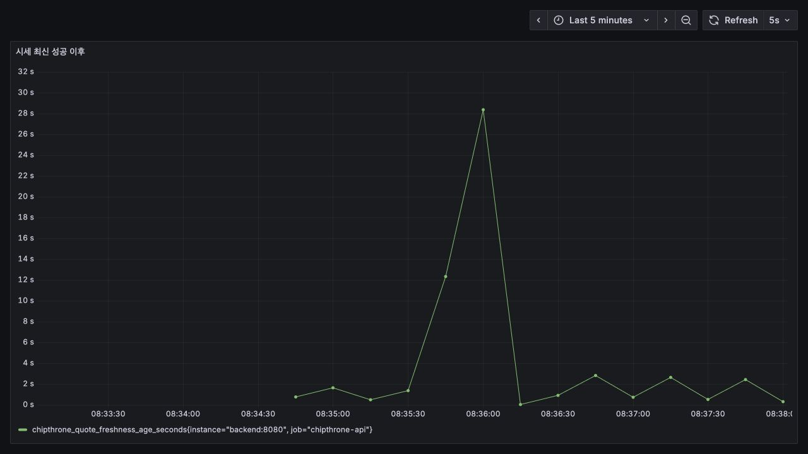
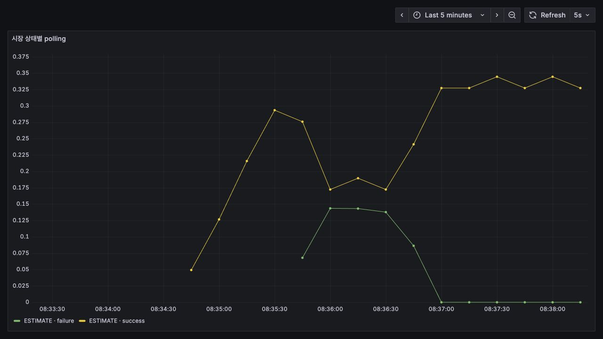

# SLO와 외부 시세 장애 복구 실험

## 목표

서비스가 살아 있어도 Hyperliquid 시세 수집만 실패할 수 있다. 이때 마지막 성공 스냅샷으로 API 가용성을 유지하면서 장애와 복구를 감지하는 시간을 측정한다.

| SLI | 목표 |
|---|---:|
| 외부 시세 장애 중 `/api/health` 성공률 | 100% |
| 시세 소스 장애 탐지(MTTD) | 20초 이내 |
| 소스 복구 후 정상 감지 | 5초 이내 |
| 활성 구독 중 마지막 성공 시세 경과 시간 | 정상 상태 10초 이내 |

장기 가용성 SLO는 운영 Prometheus의 장기 보존이 없으므로 주장하지 않는다. 현재 실험은 짧은 장애 구간의 동작을 반복 검증하는 범위다.

## 외부 API 과호출 방지

`loadtest/fake_quote_server.py`가 Hyperliquid, 금융위원회, 업비트, Slack Webhook을 모두 localhost에서 대체한다. 장애 주입도 Fake Hyperliquid 호환 엔드포인트가 HTTP 503을 반환하는 방식이다. 실제 API 키를 읽지 않고 외부 호스트를 호출하지 않는다.

```bash
cd backend
./gradlew build
cd ..
python3 loadtest/run_resilience_test.py
```

CI도 같은 스크립트를 실행한다. 테스트는 다음을 실패 조건으로 둔다.

- 연속 실패 5회 전에 장애 알림이 발생하거나 20초 안에 탐지하지 못함
- 장애 중 Health API가 한 번이라도 실패함
- Fake 장애 해제 후 10초 안에 복구 알림이 발생하지 않음
- 테스트 종료 후 주입한 장애 상태가 남음

## 관측 지표

- `chipthrone_quote_freshness_age_seconds`: 마지막 성공 수집 이후 경과 시간
- `chipthrone_quote_polls_total{result}`: 수집 성공·실패
- `http_server_requests_seconds_*`: API 성공률과 p95 응답시간

Grafana의 `CHIP THRONE · 수요 기반 시세` 대시보드에서 세 지표를 함께 본다.

## 결과

실측값은 [resilience-test-results.json](resilience-test-results.json)에 저장한다. MTTD는 장애 주입부터 Slack 장애 이벤트 수신까지, 복구 감지는 Fake 소스 정상화부터 Slack 복구 이벤트 수신까지로 계산한다.

| 측정값 | 결과 |
|---|---:|
| 실제 외부 API 호출 | 0회 |
| 장애 탐지 MTTD | 15.101초 |
| 소스 정상화 후 복구 감지 | 2.904초 |
| 전체 장애 구간 | 18.125초 |
| 장애 중 Health API | 89/89 성공 |
| 장애 탐지 시 시세 freshness | 15.185초 |

연속 실패 5회에서 장애를 감지했고, 장애 중에는 마지막 성공 스냅샷을 유지해 Health API 성공률 100%를 지켰다. Fake 소스를 정상화한 다음 polling 성공과 복구 이벤트가 함께 확인됐다.

### Grafana 부분 캡처

자동 실험과 별도로 그래프 형태를 확인하기 위해 Fake 장애를 약 20초 유지했다. 전체 대시보드가 아니라 판단에 사용한 패널만 캡처했다.





## 한계

- 외부 제공자의 실제 장애 특성 대신 HTTP 503만 재현한다.
- 시세 소스를 복구시키는 주체는 테스트이며, 애플리케이션은 마지막 성공값 유지와 장애·복구 감지를 담당한다.
- 컨테이너 응답 불능 자동 재시작은 별도의 `infra/health-recovery.sh` 경로다.
